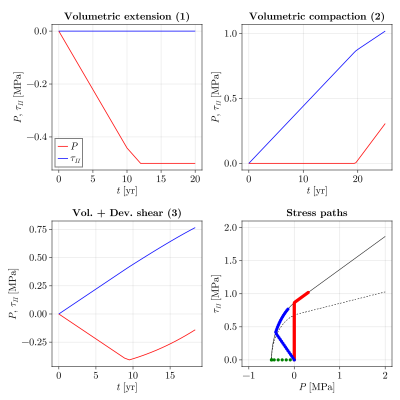

# RheologyCalculator.jl

[](https://github.com/juliageodynamics/RheologyCalculator.jl/actions/workflows/ci.yml)
[](https://juliageodynamics.github.io/RheologyCalculator.jl/stable/)
[](https://juliageodynamics.github.io/RheologyCalculator.jl/dev/)
[](https://codecov.io/gh/juliageodynamics/RheologyCalculator.jl)
[](https://juliahub.com/ui/Packages/General/RheologyCalculator)

`RheologyCalculator.jl` builds and solves local rheological models from small
viscous, elastic, and plastic building blocks. Elements can be composed in
series, in parallel, or in nested hybrid networks, then converted into a
nonlinear residual system solved with Newton iterations.

## Package layout

`RheologyCalculator.jl` is a package with the material catalogue nested
inside it as a submodule, `RheologyCalculator.RheologyModels`:

| | What it is |
| --- | --- |
| **`RheologyCalculator`** | The **core engine**: composition containers (`SeriesModel`, `ParallelModel`), equation generation, the Newton solver, and the state-function interface. Independent of any material catalogue. |
| **`RheologyCalculator.RheologyModels`** | Concrete constitutive elements (`LinearViscosity`, `Elasticity`, `DruckerPrager`, creep laws, …) plus advanced material models, defined in [`src/RheologyModels.jl`](./src/RheologyModels.jl) and [`src/rheology/`](./src/rheology). **Start here if you just want to build and solve models.** |

`RheologyModels` only exports the material catalogue. To get both the solver engine and the concrete elements, `using`
both:

```julia
using RheologyCalculator
using RheologyCalculator.RheologyModels
```

Use bare `using RheologyCalculator` on its own only when you want the solver
engine without the bundled elements (for example, to supply your own material
laws).

## Installation

```julia
using Pkg
Pkg.add("RheologyCalculator")
```

## Quick Start

To build and solve models, `using` both the engine and the `RheologyModels`
submodule:

```julia
using RheologyCalculator
using RheologyCalculator.RheologyModels

viscous = LinearViscosity(1e22)
elastic = Elasticity(1e10, 4.667e10)
c = SeriesModel(viscous, elastic)

vars   = (; ε = 1.0e-14, θ = 0.0)
args   = (; τ = 1.0e3, P = 0.0)
others = (; dt = 1.0e10, τ0 = (0.0,), P0 = (0.0,))

x0  = initial_guess_x(c, vars, args, others)
sol = solve(c, x0, vars, others)

sol.x           # solved SVector
sol.iterations  # Newton iterations taken
sol.residual    # final normalized residual norm
inspect(c)      # what each entry stands for, and which equation solves it
```

`solve` returns an `RCSolution`. It supports positional indexing (`sol[1]`) and
can be passed directly to the next `solve`; use `sol.x` for the underlying
`SVector`. A solution holds numbers only, so it is `isbits` and can be built
inside a GPU kernel; `inspect(c)` describes the entries instead:

```julia-repl
julia> inspect(c)
2-element ModelInspection:
  index  var  equation                        scope   elements
      1  τ    compute_strain_rate             global  LinearViscosity 1, Elasticity 1
      2  P    compute_volumetric_strain_rate  global  LinearViscosity 1, Elasticity 1
```

Validate models and inputs before entering a numerical kernel:

```julia
validate(c, vars, others)
```

Validation is host-side. It checks finite and physically meaningful material
parameters, required elastic history, and `isbits` compatibility without adding
work to `solve`.

## Batch solves and diagnostics

For a fixed model, `solve_batch` accepts statically sized tuples of independent
local systems and returns a statically sized tuple of `RCSolution`s:

```julia
xs = (x0_point_1, x0_point_2)
vs = (vars_point_1, vars_point_2)
os = (others_point_1, others_point_2)
solutions = solve_batch(c, xs, vs, os)
```

This reference path avoids `Vector`-based device data structures. Per-point
recovery from difficult solves is available through the explicit host-side
`solve_with_retries` helper; ordinary `solve` remains deterministic.

`jacobian(c, x, vars, others)` exposes the local residual Jacobian. It currently
uses ForwardDiff and provides the boundary for future analytic or sparse
backends.

## Consistent tangents

The scalar `tangent` returns `dτII/dεII` for a converged local solve.
`tangent_tensor` expands isotropic deviatoric response into the package's Voigt
layout: `(xx, yy, xy)` in 2-D and `(xx, yy, zz, yz, xz, xy)` in 3-D. Shear
entries are tensor components, not engineering shear components.

For scalar deviatoric/volumetric models, `tangent_block` returns:

```text
[ dτ/dε  dτ/dθ ]
[ dP/dε  dP/dθ ]
```

It uses implicit differentiation through the complete local residual system,
so plastic coupling is included whenever the model contributes the relevant
equations. All tangent results are fixed-size and `isbits`.

## Composite Models

Models are assembled with `SeriesModel` and `ParallelModel`:

```julia
maxwell = SeriesModel(LinearViscosity(1e22), IncompressibleElasticity(1e10))
kv      = ParallelModel(LinearViscosity(1e21), IncompressibleElasticity(1e10))
burgers = SeriesModel(LinearViscosity(1e22), kv)
```

Nested generalized Maxwell / Kelvin-Voigt branches are supported, including
elastic elements inside parallel branches:

```julia
c = SeriesModel(
    LinearViscosity(1e22),
    ParallelModel(
        LinearViscosity(1e21),
        SeriesModel(LinearViscosity(1e21), IncompressibleElasticity(1e10)),
    ),
)
```


See [`examples/Maxwell_KV_Maxwell.jl`](./examples/Maxwell_KV_Maxwell.jl) for a
comparison against the analytical solution, and
[`docs/src/strain_rate_correction.md`](./docs/src/strain_rate_correction.md) for
the elastic correction derivation.

## Material models

`RheologyModels` bundles a catalogue of advanced material models. To
keep the namespace small they are **not exported** — access them via the module
prefix or an explicit import:

```julia
using RheologyCalculator
using RheologyCalculator.RheologyModels
import RheologyCalculator.RheologyModels: DruckerPragerCap, Hyperbolic, ModCamClay, Golchin, RateStateFriction
```

### VEP + Cap (Popov et al., 2025)



### Hyperbolic (Abbo & Sloan, 1995)


### Modified Cam-Clay - classical (e.g., de Souza Neto book)


### Modified Cam-Clay - Golchin (Golchin et al., 2021)


### Rate and State friction (Herrendörfer et al., 2018)


